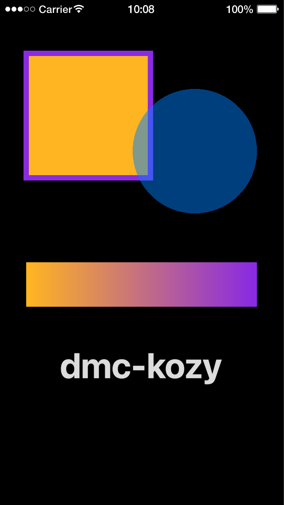

# dmc-kozy

Graphics 1.0 conveniences for Solar2D (formerly Corona SDK): colors in 0-255 and hex, and objects placed by reference points, in code written for Graphics 2.0.

dmc-kozy gives you its own `display` and `native` tables. Objects made with them take 0-255 colors, hex strings and anchors the old way; everything else is Solar2D's own:

```lua
local display, native = require( 'dmc_corona.dmc_kozy' )()

local rect = display.newRect( 0, 0, 200, 100 )
rect:setFillColor( 255, 180, 34 )
rect:setStrokeColor( '#8A2BE2' )
rect:setReferencePoint( display.TopLeftReferencePoint )
```

## Features

- `setFillColor()` and `setStrokeColor()` take 0-255 values, hex strings (`'#FFB422'`) and gradients with 0-255 colors; so does `setTextColor()` on native text fields
- `setAnchor( x, y )`, and `setReferencePoint()` with the nine Graphics 1.0 reference points (`display.TopLeftReferencePoint`, ...)
- Local by default: only the files that require dmc-kozy see the change, so other libraries keep Solar2D's `display` and `native`
- Each change can be turned off in `dmc_corona.cfg`
- Pure Lua, no plugins needed; MIT licensed

dmc-kozy is for new code. For an existing Graphics 1.0 app, [dmc-kompatible](https://github.com/dmccuskey/dmc-kompatible) does the same, and more of it. If you only need the colors, [dmc-kolor](https://github.com/dmccuskey/dmc-kolor) translates them without changing any Solar2D method.

## Quick Start

The following code will get you up and running in about 10 minutes in the Solar2D Simulator on macOS or Windows. It draws shapes with 0-255, hex and gradient colors, placed by their corners.

Prerequisites: the [Solar2D](https://solar2d.com/) Simulator and a copy of this repository (`git clone https://github.com/dmccuskey/dmc-kozy.git`, or download the ZIP from GitHub).

### 1. Copy the Library into Your Project

Copy these from this repository into the root of your project folder:

```text
dmc_corona_boot.lua     loader for the DMC libraries
dmc_corona.cfg          configuration
dmc_corona/             dmc-kozy
```

**Going further:** keep the libraries in a subfolder, or combine several DMC libraries ([dmc-corona-boot Configuration](https://github.com/dmccuskey/dmc-corona-boot/blob/master/docs/configuration.md)).

### 2. Draw with Graphics 1.0 Colors and Reference Points

Create `main.lua` in the project folder:

```lua
local display, native = require( 'dmc_corona.dmc_kozy' )()

local W, H = display.contentWidth, display.contentHeight

-- an orange square with a purple border, placed by its top-left corner
local square = display.newRect( 0, 0, 280, 280 )
square:setReferencePoint( display.TopLeftReferencePoint )
square.x, square.y = 60, 120
square:setFillColor( 255, 180, 34 )
square.strokeWidth = 12
square:setStrokeColor( '#8A2BE2' )

-- a half-transparent blue circle, placed by its bottom-right corner
local circle = display.newCircle( W-60, 480, 140 )
circle:setAnchor( 1, 1 )
circle:setFillColor( 0, 128, 255, 0.5 )

-- a bar fading from orange to purple
local bar = display.newRect( W/2, 640, W-120, 100 )
bar:setFillColor{ type='gradient', color1={ 255, 180, 34 }, color2={ 138, 43, 226 }, direction='right' }

-- light grey text
local label = display.newText( 'dmc-kozy', W/2, 820, native.systemFontBold, 80 )
label:setFillColor( 220 )

print( square.anchorX, square.anchorY, square.fill.r, square.fill.g, square.fill.b )
```

Open the project in the Simulator. It shows an orange square with a purple border, a see-through blue circle over its corner, a bar fading from orange to purple, and grey text; the console shows the square's anchor and its color in Solar2D's 0-1 values:

```text
0	0	1	0.70588237047195	0.13333334028721
```



If the console shows `module 'dmc_corona.dmc_kozy' not found` instead, `dmc_corona/` is missing from the root of the project folder. Require it by that full name: `require( 'dmc_kozy' )` fails, because the loader that finds the DMC libraries runs only once dmc-kozy is loading.

**Going further:** which objects get which methods, the settings and the known issues are below.

To update, copy `dmc_corona_boot.lua` and `dmc_corona/` again from the newer version. Keep your own `dmc_corona.cfg` if you have changed it.

## API

```lua
local display, native = require( 'dmc_corona.dmc_kozy' )()
```

Call the module to get the two tables. It also holds them as `.display` and `.native`, and its version as `.VERSION`. Anything dmc-kozy doesn't change falls through to Solar2D's own `display` and `native`, so `display.contentWidth` and `native.systemFont` work as usual.

### Objects and Their Methods

These constructors return Solar2D's object with methods added:

| constructor | `setAnchor()`, `setReferencePoint()` | `setFillColor()` | `setStrokeColor()` |
|---|---|---|---|
| `display.newCircle`, `newPolygon`, `newRect`, `newRoundedRect` | yes | yes | yes |
| `display.newImage`, `newImageRect`, `newText` | yes | yes | |
| `display.newLine` | yes | | yes |
| `display.newGroup`, `newContainer`, `newSprite` | yes | | |
| `native.newTextField`, `newTextBox` | yes | `setTextColor()` instead | |
| `native.newWebView` | yes | | |

Solar2D's own method is kept on the object with an underscore: `object:_setFillColor( 1, 0, 0 )` takes 0-1 values. A constructor that returns `nil`, such as `display.newImage()` for a missing file, returns `nil` here too.

Objects made any other way, including with Solar2D's own `display` in a file that doesn't require dmc-kozy, are unchanged.

### object:setFillColor( ... ), object:setStrokeColor( ... ), field:setTextColor( ... )

The color, in one of these forms:

| form | example | notes |
|---|---|---|
| gray | `( 128 )` | 0-255 |
| gray, alpha | `( 128, 0.5 )` | alpha as below |
| red, green, blue | `( 255, 180, 34 )` | 0-255 |
| red, green, blue, alpha | `( 0, 128, 255, 0.5 )` | alpha 0-1; 0-255 with `ACTIVATE_ZEROONE_ALPHA` off |
| hex string | `( '#FFB422' )` | `#RRGGBB`, no alpha |
| gradient | `{ type='gradient', color1={ 255, 180, 34 }, color2={ 138, 43, 226 }, direction='down' }` | colors 0-255, alpha optional; your table is left as it is |
| other paint | `{ type='image', filename='wood.png' }` | passed to Solar2D unchanged |

Solar2D's own 0-1 values don't work on these objects: `( 1, 0, 0 )` is nearly black. Anything else raises an error, such as a color name (`'red'`: use [dmc-kolor](https://github.com/dmccuskey/dmc-kolor) for names), a short hex string (`'#F00'`) or a string among the numbers.

### object:setAnchor( x [, y] ), object:setReferencePoint( point )

Set `anchorX` and `anchorY`, from 0 to 1. `setAnchor()` takes two numbers or a table, `{ x, y }`; a value left out keeps its current one. `setReferencePoint()` takes one of the reference points; Solar2D's own `display.CenterReferencePoint` (and the others) work too. Anything else raises an error, including `nil` from a misspelled name:

| `display.` | anchor | `display.` | anchor | `display.` | anchor |
|---|---|---|---|---|---|
| `TopLeftReferencePoint` | 0, 0 | `TopCenterReferencePoint` | 0.5, 0 | `TopRightReferencePoint` | 1, 0 |
| `CenterLeftReferencePoint` | 0, 0.5 | `CenterReferencePoint` | 0.5, 0.5 | `CenterRightReferencePoint` | 1, 0.5 |
| `BottomLeftReferencePoint` | 0, 1 | `BottomCenterReferencePoint` | 0.5, 1 | `BottomRightReferencePoint` | 1, 1 |

Unlike Graphics 1.0, the object keeps its `x` and `y`, so it moves on screen: set `x` and `y` after the reference point, as in the Quick Start. A group's anchor only has an effect with `group.anchorChildren = true` (Solar2D's rule).

### native.setKeyboardFocus( object )

Solar2D's own, except that an object from [DMC-Corona-UI](https://github.com/dmccuskey/DMC-Corona-UI), such as its text field, is given the focus through its own `setKeyboardFocus()`.

## Configuration

The `[DMC_KOZY]` section of `dmc_corona.cfg`; all settings are read once, when dmc-kozy is first required. All are booleans: `MAKE_GLOBAL:BOOL = true`, or `MAKE_GLOBAL = true` without the type. For the file format, see [dmc-corona-boot Configuration](https://github.com/dmccuskey/dmc-corona-boot/blob/master/docs/configuration.md).

| setting | type | default | effect |
|---|---|---|---|
| `MAKE_GLOBAL` | bool | `false` | replace the global `display` and `native` with dmc-kozy's, for every file and every other library in the app. Use with care: other code may expect Solar2D's own |
| `ACTIVATE_ZEROONE_ALPHA` | bool | `true` | alpha is 0-1; `false`: 0-255, like the colors |
| `ACTIVATE_ANCHOR` | bool | `true` | add `setAnchor()` and `setReferencePoint()` |
| `ACTIVATE_FILLCOLOR` | bool | `true` | add the 0-255 `setFillColor()`, and `setTextColor()` on native text fields |
| `ACTIVATE_STROKECOLOR` | bool | `true` | add the 0-255 `setStrokeColor()` |

## Known Issues

None known. The changes in each version are in the [CHANGELOG](CHANGELOG.md).

## Development

Only `dmc_corona/dmc_kozy.lua` is written in this repository; it needs no other module. `dmc_corona_boot.lua` is a generated copy from [dmc-corona-boot](https://github.com/dmccuskey/dmc-corona-boot); fix it there, then rebuild. The copy is made by Snakemake from sibling checkouts (`../dmc-corona-boot`, `../DMC-Corona-Library` for the shared rules). From this repository's root folder:

```sh
snakemake --cores 1 build_all
```

The unit tests run in plain Lua 5.1, with stand-ins for Solar2D's `display` and `native`:

```sh
tests/run_unit.sh
```

They need Lua 5.1 and dkjson; `LUA=` names the interpreter. The Quick Start is the check that it works in Solar2D.

## License

dmc-kozy is released under the [MIT License](LICENSE).
